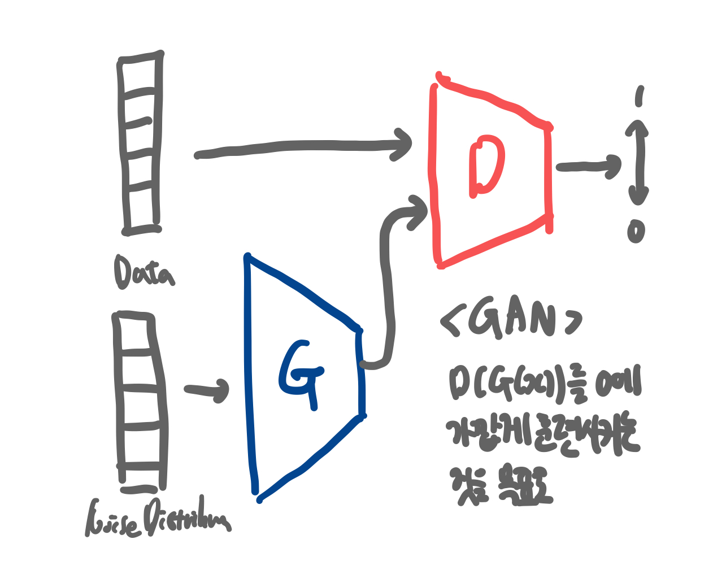

# 생성 모델에 대한 논문 정리

## Generative Model

-   A statistical model of the joint probability distribution
-   An architecture to generate new data instances

생성 모델은 실존하지 않지만 있을 법한 이미지를 훈련 데이터셋의 확률 분포로 만들어낸다.

## Generative Adversarial Nets

GAN은 Generative Adversial Network의 약자로 Discriminator와 Generator 신경망이 서로 적대적으로 학습시키며 실제 데이터와 비슷한 데이터를 생성 해내는 모델이다. 이렇게 생성된 데이터에는 정해진 label값이 없기 때문에 비지도 학습 기반 생성모델로 분류된다.

GAN은 Generator와 Discriminator라는 서로 다른 2개의 네트워크로 이루어져 있으며 이 두 네트워크를 적대적으로 학습시키며 목적을 달성한다. 생성모델의 목적은 진짜 분포에 가까운 가짜분포를 생성하는 것이고 판별모델의 목적은 표본이 가짜분포에 속하는지 진짜분포에 속하는지를 결정하는 것이다. GAN의 궁극적인 목표는 "실제 데이터의 분포"에 가까운 데이터를 생성하는 것이여서 판별기가 진짜인지 가짜인지를 한 쪽으로 판단하지 못하는 경계(1/2)에서 최적 솔루션으로 간주하게 된다.

G는 데이터를 생성하여 자신이 생성한 데이터를 최대한 실제 데이터처럼 만들어서 D를 속이려고 하는 것이고, D는 최대한 정확하게 구별해 내려는 방식으로 학습이 진행되어서 두 신경망의 구조가 '적대적이다'라는 것에서 adversial이 붙게 된 것이다.

### 학습과정

-   D의 학습과정

    -   m개의 noise 샘플을 noise 분포로부터 추출하고 m개의 실측데이터를 실측데이터 분포에서 추출한다.
    -   D를 SG 값만큼 상승시켜서 Update 해준다.
    -   이 과정을 k번 반복한다. (이때 G는 학습 X)

-   G의 학습과정
    -   m개의 noise 샘플을 noise 분포로부터 추출한다.
    -   G를 SG 값만큼 하강시켜서 Update 한다.
    -   다음 epoch로 넘어간다.

<strong>문제점</strong>

학습 초반에는 G의 weight들과 bias들이 제대로 학습되어있지 않기 때문에, 실측데이터와 너무나 확연하게 다른 데이터를 생성해내게 된다. 이로인해 D는 입력된 G(z)의 값에 대하여 거의 0에 가까운 값을 출력하게 되면서 gradient 값이 너무 낮아 학습이 제대로 이루어지지 않는 현상이 발생한다.

따라서 결론적으로 D(G(z))를 maximize하는 방향으로 학습 시키는 것이 그 해결책이다.

### 수식

### 한계점

GAN은 기술적으로 고해상도 이미지를 생성할 수 없다는 점과 학습이 불안정하다는 점을 한계점으로 가지고 있다. 이러한 한계점은 후속 GAN 모델이 개발되면서 해결되었다. (추후 Diffusion Model의 승리 과정 학습)

-   악용가능성, 지식 재산권 이슈 등

### 더 공부할 것

DCGAN, CycleGAN 등 추가 공부가 필요하다....

### IS (Inception Score)

Inception Score는 GAN의 평가에 널리 쓰이는 지표이다. 이 지표는 클래스 label과 관련하여 특징적인 속성들을 잡아내기 위해 Pre-trained 신경망을 사용한다.

샘플의 조건부 분포와 모든 샘플에서 얻은 주변분포 사이의 평균적인 KL 발산 정도를 측정하는 것이다. 이 값이 높을수록 좋은 성능을 낸다고 해석할 수 있다.

### FID (Frechet Inception Distance)

FID는 생성되는 이미지의 퀄리티 일관성을 유지하기 위해 이용되는 지표이다. 실제 데이터의 분포를 활용하지 않는 단점을 보완하여 실제 데이터와 생성된 데이터에서 얻은 feature의 평균과 공분산을 비교하는 방식이다. FID가 낮을수록 이미지의 퀄리티가 더 좋아지는데 이는 실제 이미지와 생성된 이미지의 유사도가 높아지는 것을 의미한다. 즉 쉽게 말해 FID는 생성된 샘플들의 통계와 실제 샘플들의 통계를 비교하는 것이다.
