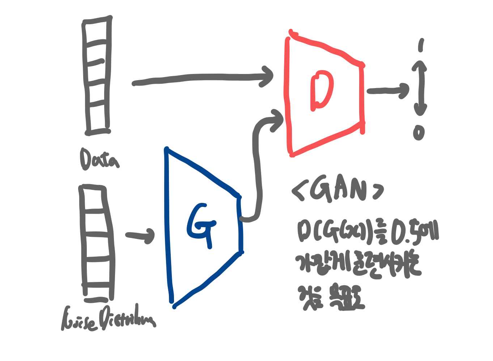

# 생성 모델에 대한 논문 정리

## Generative Adversarial Nets

GAN은 Generative Adversial Network의 약자로 Discriminator와 Generator 신경망이 서로 적대적으로 학습시키며 실제 데이터와 비슷한 데이터를 생성 해내는 모델이다. 이렇게 생성된 데이터에는 정해진 label값이 없기 때문에 비지도 학습 기반 생성모델로 분류된다.

GAN은 Generator와 Discriminator라는 서로 다른 2개의 네트워크로 이루어져 있으며 이 두 네트워크를 적대적으로 학습시키며 목적을 달성한다. 생성모델의 목적은 진짜 분포에 가까운 가짜분포를 생성하는 것이고 판별모델의 목적은 표본이 가짜분포에 속하는지 진짜분포에 속하는지를 결정하는 것이다. GAN의 궁극적인 목표는 "실제 데이터의 분포"에 가까운 데이터를 생성하는 것이여서 판별기가 진짜인지 가짜인지를 한 쪽으로 판단하지 못하는 경계(1/2)에서 최적 솔루션으로 간주하게 된다.



G는 데이터를 생성하여 자신이 생성한 데이터를 최대한 실제 데이터처럼 만들어서 D를 속이려고 하는 것이고, D는 최대한 정확하게 구별해 내려는 방식으로 학습이 진행되어서 두 신경망의 구조가 '적대적이다'라는 것에서 adversial이 붙게 된 것이다.

### 학습과정

-   D의 학습과정

    -   m개의 noise 샘플을 noise 분포로부터 추출하고 m개의 실측데이터를 실측데이터 분포에서 추출한다.
    -   D를 SG 값만큼 상승시켜서 Update 해준다.
    -   이 과정을 k번 반복한다. (이때 G는 학습 X)

-   G의 학습과정
    -   m개의 noise 샘플을 noise 분포로부터 추출한다.
    -   G를 SG 값만큼 하강시켜서 Update 한다.
    -   다음 epoch로 넘어간다.

<strong>문제점</strong>

학습 초반에는 G의 weight들과 bias들이 제대로 학습되어있지 않기 때문에, 실측데이터와 너무나 확연하게 다른 데이터를 생성해내게 된다. 이로인해 D는 입력된 G(z)의 값에 대하여 거의 0에 가까운 값을 출력하게 되면서 gradient 값이 너무 낮아 학습이 제대로 이루어지지 않는 현상이 발생한다.

따라서 결론적으로 D(G(z))를 maximize하는 방향으로 학습 시키는 것이 그 해결책이다.


### 수식


위 수식을 해석하면 D가 실제 데이터에 대해서

### Generative Model

-   A statistical model of the joint probability distribution
-   An architecture to generate new data instances

생성 모델은 실존하지 않지만 있을 법한 이미지를 훈련 데이터셋의 확률 분포로 만들어낸다.

### 확률분포

확률 변수가 특정한 값을 가질 확률을 나타내는 함수를 의미한다.

### 이산확률분포

확률변수 X의 개수를 정확히 셀 수 있을 때 이산확률분포라고 말한다.

### 연속확률분포

확률변수 X의 개수를 정확히 셀 수 없을 때 연속 확률분포라고 말한다.

ex) 정규분포

<strong>정규 분포(Gaussian Distribution)</strong>

연속 확률 분포의 하나이다. 정규분포는 수집된 자료의 분포를 근사하는 데에 자주 사용된다. 이것은 중심극한정리에 의하여 독립적인 확률변수들의 평균은 정규분포에 가까워지는 성질이 있기 때문이다.

사람의 얼굴에도 통계적인 평균치가 존재할 수 있다. 모델은 이를 수치적으로 표현할 수 있게 된다. 이때의 확률 분포는 이미지에서의 다양한 특징들이 각각의 확률 변수가 되는 분포를 의미한다.

<strong>다변수 확률 분포</strong>


<strong>가우시안 노이즈</strong>


이런 식으로 사진이 지지직 거리는 느낌의 잡음을 가우시안 노이즈라고 한다. 이름이 가우시안 노이즈인 이유는, 이름처럼 가우스 함수에 따른 분포를 따르고 있기 때문이다.

```python
def make_noise(std, gray):
    height, width = gray.shape
    img_noise = np.zeros((height, width), dtype=np.float)
    for i in range(height):
        for a in range(width):
            make_noise = np.random.normal()  # 랜덤함수를 이용하여 노이즈 적용
            set_noise = std * make_noise
            img_noise[i][a] = gray[i][a] + set_noise
    return img_noise
```

### KL Divergence

두 확률분포가 얼마나 다른지 그 차이를 측정하기 위해 사용되는 식이다. KL Divergence는 비교하려는 확률질량함수의 정보량에서 기준이 되는 확률질량함수의 정보량을 뺀값에 기준이 되는 확률질량함수의 확률분포에 대한 기대값을 씌워준 것을 의미한다.
