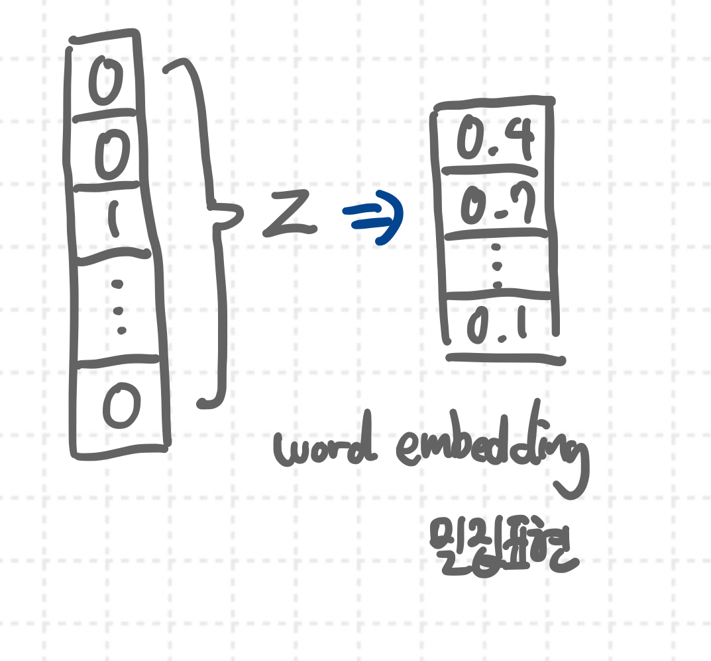

# Pytorch 모르는 것들 정리

## Embedding Layer

Embedding 이라는 말은 NLP에서 많이 만날 수 있다. 이산적 범주형 변수를 sparse한 one-hot 인코딩으로 나타내는 것이 아니라 연속적인 값을 가지는 벡터로 표현하는 방법을 말한다. 즉, 수많은 단어를 one-hot 인코딩하면 수치로는 표현이 가능하겠지만 대부분의 값이 0이 되어버리기 때문에 매우 sparse 해지기 때문에 임의의 길이의 실수 벡터로 밀집되게 나타나게 하는 것을 일련의 임베딩이라고 한다. 각 카테고리를 나타내는 벡터를 임베딩 벡터라고 한다.



```python
torch.nn.Embedding(num_embeddings, embedding_dim, padding_idx, max_norm, norm_type)
```

-   num_embeddings: 임베딩 벡터를 생성할 전체 범주의 개수
-   embedding_dim: 임베딩 벡터의 차원
-   padding_idx: 지정된 인덱스에 대해서는 학습이 진행되지 않는다.
-   max_norm: 특정 실수가 주어지고 임베딩 벡터의 norm이 이 값보다 크면 norm이 이 값에 맞추어지도록 정규화된다.

## Regularization

<strong>Batch</strong>는 한 에포크에 모든 데이터를 신경망이 처리하고 평균 기울기로 경사하강법을 진행하면 메모리가 부족할 수 있어서 데이터셋을 나눠서 학습을 진행하는 단위를 말한다.

학습 데이터를 Batch로 나누어서 Stochastic Gradient Descent 를 실시한다. => 효율적인 학습이 가능하다.

-   학습데이터 전체 학습을 끝내면 한 Epoch가 끝난다.
-   Gradient를 구하는 단위는 Batch.

### Problem

Batch로 나누어서 학습을 진행할 경우 Internal Covariant Shift 문제나 fully connected 연산 이후에 데이터의 분포가 달라질 수 있다는 문제를 가지고 있다. Internal Covariant Shift 문제는 학습 과정에서 계층 별로 입력 데이터의 분포가 달라지는 현상이다. 또 각 계층에서 입력 받은 feature은 convolution 연산이나 fully connected 연산을 거치고 데이터 분포가 달라질 수 있다.


### Solution

-   Change Activation Function
-   Careful Initialization - He initialization, Xavier Initialization
-   Small Learning rate
-   Batch Normalization

### Change Activation Function

활성화 함수가 필요한 이유는 바로 선형적으로 연결된 신경망에 활성화 함수가 없다면 아무리 신경망이 깊어지더라도 선형적인 관계만 나타낼 수 있기 때문이다. 비선형적인 데이터의 분류등을 진행하기 위해서 활성화 함수가 각 계층마다 필요한 것이다.

Sigmoid 함수는 신경망이 깊어지면 깊어질수록 기울기가 소실되는 문제가 발생한다. 0에서 1사이의 값으로 반환하기 때문에 값이 점차 작아지는 Gradient Vanishing 문제가 발생할 수 있다. 이로 인해서 많은 깊은 신경망에서는 ReLU 활성화 함수가 사용된다. ReLU가 0이하의 값을 모두 0으로 처리하는 문제를 LeakyReLU라는 활성화함수가 해결하는 등 활성화 함수는 계속 발전하고 있어서 활성화 함수를 바꿔서 학습을 더 잘 진행할 수 있다.

### Careful Initialization

<strong>He Initialization</strong>

<strong>Xavier Initialization</strong>

### Small Learning Rate

너무 학습률이 크면 확률적 경사 하강법을 실시하다가 Gradient Exploding 문제가 발생할 수 있다. 적당한 Learning Rate를 설정하면 문제를 해결할 수 있다.

### Batch Normalization

학습 과정에서 각 배치 단위별로 데이터가 다양한 분포를 가지더라도 각 배치별로 "평균", "분산"을 이용해 정규화하는 것을 뜻한다. 학습 과정에서는 평균과 분산을 각 배치마다 구해서 정규화를 진행하고 추론 과정에서는 학습 과정에서 구한 평균과 분산을 이용하여 정규화를 진행한다.

<strong>Pytorch</strong>

```python
torch.nn.BatchNorm1d(num_features)
torch.nn.BatchNorm2d(num_features)
```

-   BatchNorm1d
    Input 과 Output이 (N, C) 또는 (N, C, L) 의 형태를 가진다.

-   BatchNorm2d
    Input 과 OUtput이 (N, C, H, W) 의 형태를 가진다.
    C는 Channel을 말한다.
