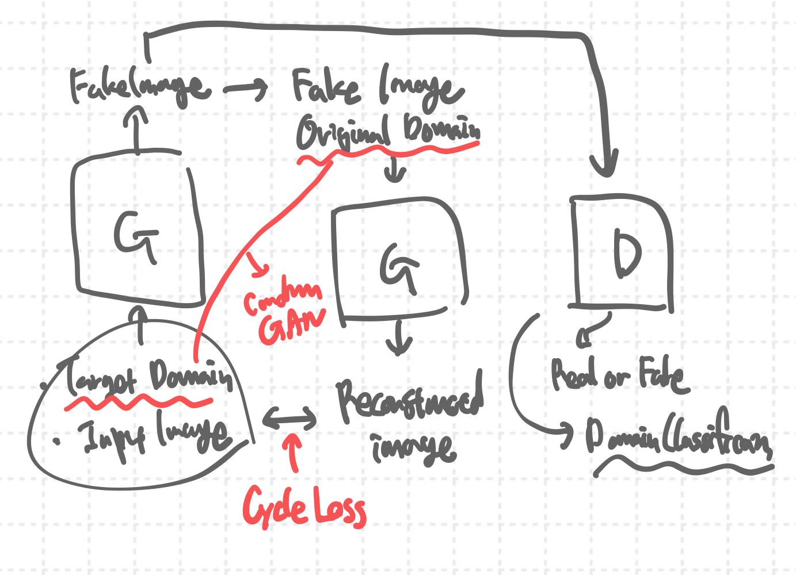

# Generative Model

## Index

<!-- TOC -->

- [Generative Model](#generative-model)
    - [Index](#index)
    - [Generative Model Definition](#generative-model-definition)
    - [Variational AutoEncoder](#variational-autoencoder)
        - [Autoencoder](#autoencoder)
        - [VAE](#vae)
        - [사용사례](#%EC%82%AC%EC%9A%A9%EC%82%AC%EB%A1%80)
    - [Generative Adversarial Nets](#generative-adversarial-nets)
        - [학습과정](#%ED%95%99%EC%8A%B5%EA%B3%BC%EC%A0%95)
        - [Loss Function Formula](#loss-function-formula)
        - [한계점](#%ED%95%9C%EA%B3%84%EC%A0%90)
        - [IS Inception Score](#is-inception-score)
        - [FID Frechet Inception Distance](#fid-frechet-inception-distance)
    - [Conditional GAN](#conditional-gan)
    - [Pix2Pix](#pix2pix)
    - [CycleGAN](#cyclegan)
        - [CycleGAN의 발단](#cyclegan%EC%9D%98-%EB%B0%9C%EB%8B%A8)
        - [CycleGAN's Key POINTS](#cyclegans-key-points)
        - [CycleGAN 구현](#cyclegan-%EA%B5%AC%ED%98%84)
        - [CycleGAN's drawbacks](#cyclegans-drawbacks)
    - [DCGAN](#dcgan)
    - [WGAN-CP and WGAN-GP](#wgan-cp-and-wgan-gp)
        - [WGAN](#wgan)
        - [Wassertain Loss](#wassertain-loss)
    - [StarGAN](#stargan)
    - [PGGAN: Progressive Growing of GANs](#pggan-progressive-growing-of-gans)
    - [StyleGAN: A Style-Based Generator Architecture for Generative Adversarial Networks](#stylegan-a-style-based-generator-architecture-for-generative-adversarial-networks)
        - [StyleGAN의 의의](#stylegan%EC%9D%98-%EC%9D%98%EC%9D%98)
        - [StyleGAN's Key IDEA: Mapping Network](#stylegans-key-idea-mapping-network)
        - [AdaIN Adaptive Instance Normalization](#adain-adaptive-instance-normalization)
        - [StyleGAN's Architecture](#stylegans-architecture)
        - [AdaIN](#adain)
    - [Pixel2Style2Pixel](#pixel2style2pixel)

<!-- /TOC -->

## Generative Model Definition

-   A statistical model of the joint probability distribution
-   An architecture to generate new data instances

생성 모델은 실존하지 않지만 있을 법한 이미지를 훈련 데이터셋의 확률 분포로 만들어낸다.

## Variational AutoEncoder

### Autoencoder


-   Encoder : 고차원의 입력 데이터 -> 저차원의 표현 벡터
-   Decoder : 표현 벡터 -> 원본 차원

AutoEncoder은 입력데이터와 Decoder의 출력과의 손실을 최소화하는 방향으로 훈련된다. AutoEncoder의 Encoder Decoder에서는 FC를 사용하거나 Conv와 Deconv 블록이 사용된다.

|          | Conv              | Conv Transpose    |
| -------- | ----------------- | ----------------- |
| 구조     | Encoder           | Decoder           |
| 사용목적 | 이미지크기 줄이기 | 이미지크기 늘리기 |
| 역할     | 특징추출          | 특징복원          |

<strong>Conv Transpose</strong>는 output의 크기를 줄여서 feature을 추출하는 convolutional layer와는 반대로 output의 크기가 input보다 커지게 하는 방법으로 Upsampling의 한 종류이다. Upsampling에는 unpooling과 transposed convolution이 있다. Upsampoling은 input 이미지를 압축된 벡터로 표현했다가 원래의 input 이미지와 동일한 크기로 되돌릴 때 사용될 수 있다.


Transposed Convolution은 input의 빨간색 원소를 3x3 kernel에 곱해서 output에 대응하는 자리에 집어넣고 같은 방법으로 다른 부분도 집어넣는다. 연산을 반복하면서 겹치는 부분의 값을 모두 더해준다.

### VAE

VAE는 AE를 진화시킨 버젼이라고 볼 수 있다. AE의 Bottle Neck 부분을 진화시켜서 바로 잠재 벡터화하는 것이 아니라 인코더의 각 입력을 평균 벡터와 분산 벡터로 매핑하는 과정을 거친다. 논문의 저자들은 이 두 벡터를 Reparameterization Trick을 사용하여 Backpropagation 할 수 있도록 했다고 한다.


```python
def loss_function(x, x_gen, mu, sigma):
  BCE = nn.BCELoss(x_gen, x, reduction="sum")

  # 0.5 * sum(1 + log(sigma^2) - mu^2 - sigma^2)
  KLD = -0.5 * torch.sum(1+sigma-mu.pow(2)-sigma.exp())
```

### 사용사례

-   구글이 이미지를 VAE로 디코딩하여 이미지 용량을 줄여 밴드위치를 줄였다고 한다.
-   Image Segmentation 기법에 활용될 수 있다. (자율주행차)
-   Noisy Image를 재구성해서 Denoise 작업을 수행할 수 있다.
-   Neural Inpainting으로 이미지를 복원할 수 있다. (워터마크 없애기)

## Generative Adversarial Nets

GAN은 Generative Adversial Network의 약자로 Discriminator와 Generator 신경망이 서로 적대적으로 학습시키며 실제 데이터와 비슷한 데이터를 생성 해내는 모델이다. 이렇게 생성된 데이터에는 정해진 label값이 없기 때문에 비지도 학습 기반 생성모델로 분류된다.

GAN은 Generator와 Discriminator라는 서로 다른 2개의 네트워크로 이루어져 있으며 이 두 네트워크를 적대적으로 학습시키며 목적을 달성한다. 생성모델의 목적은 진짜 분포에 가까운 가짜분포를 생성하는 것이고 판별모델의 목적은 표본이 가짜분포에 속하는지 진짜분포에 속하는지를 결정하는 것이다. GAN의 궁극적인 목표는 "실제 데이터의 분포"에 가까운 데이터를 생성하는 것이여서 판별기가 진짜인지 가짜인지를 한 쪽으로 판단하지 못하는 경계(1/2)에서 최적 솔루션으로 간주하게 된다.


G는 데이터를 생성하여 자신이 생성한 데이터를 최대한 실제 데이터처럼 만들어서 D를 속이려고 하는 것이고, D는 최대한 정확하게 구별해 내려는 방식으로 학습이 진행되어서 두 신경망의 구조가 '적대적이다'라는 것에서 adversial이 붙게 된 것이다.

### 학습과정

-   D의 학습과정

    -   m개의 noise 샘플을 noise 분포로부터 추출하고 m개의 실측데이터를 실측데이터 분포에서 추출한다.
    -   D를 SG 값만큼 상승시켜서 Update 해준다.
    -   이 과정을 k번 반복한다. (이때 G는 학습 X)

-   G의 학습과정
    -   m개의 noise 샘플을 noise 분포로부터 추출한다.
    -   G를 SG 값만큼 하강시켜서 Update 한다.
    -   다음 epoch로 넘어간다.

<strong>문제점</strong>

학습 초반에는 G의 weight들과 bias들이 제대로 학습되어있지 않기 때문에, 실측데이터와 너무나 확연하게 다른 데이터를 생성해내게 된다. 이로인해 D는 입력된 G(z)의 값에 대하여 거의 0에 가까운 값을 출력하게 되면서 gradient 값이 너무 낮아 학습이 제대로 이루어지지 않는 현상이 발생한다.

따라서 결론적으로 D(G(z))를 maximize하는 방향으로 학습 시키는 것이 그 해결책이다.


### Loss Function Formula


GAN 신경망의 목표는 Generator의 손실을 최소화하고 Discriminator의 손실을 극대화하는 것이다. 왜 Discriminator의 손실을 극대화 해야하는지 묻는다면 Discriminator의 task는 곧 Generator가 생성한 새로운 Distribution과 원본 데이터 Distribution을 구별하는 것이기에 이 손실이 높으면 높을수록 Generator가 원본 데이터셋의 Distribution과 유사한 데이터 분포를 구사한 것이기 때문이다. 코드를 살펴보면 알 수 있겠지만 Discriminator 신경망을 backpropagation 할 때는 왼쪽과 오른쪽 둘다 사용하고 Generator 신경망을 backpropagation 할 때는 오른쪽 식만 사용한다.

### 한계점

GAN은 기술적으로 고해상도 이미지를 생성할 수 없다는 점과 학습이 불안정하다는 점을 한계점으로 가지고 있다. 이러한 한계점은 후속 GAN 모델이 개발되면서 해결되었다. (추후 Diffusion Model의 승리 과정 학습)

-   악용가능성, 지식 재산권 이슈 등

### IS (Inception Score)

Inception Score는 GAN의 평가에 널리 쓰이는 지표이다. 이 지표는 클래스 label과 관련하여 특징적인 속성들을 잡아내기 위해 Pre-trained 신경망을 사용한다.

샘플의 조건부 분포와 모든 샘플에서 얻은 주변분포 사이의 평균적인 KL 발산 정도를 측정하는 것이다. 이 값이 높을수록 좋은 성능을 낸다고 해석할 수 있다.

### FID (Frechet Inception Distance)

FID는 생성되는 이미지의 퀄리티 일관성을 유지하기 위해 이용되는 지표이다. 실제 데이터의 분포를 활용하지 않는 단점을 보완하여 실제 데이터와 생성된 데이터에서 얻은 feature의 평균과 공분산을 비교하는 방식이다. FID가 낮을수록 이미지의 퀄리티가 더 좋아지는데 이는 실제 이미지와 생성된 이미지의 유사도가 높아지는 것을 의미한다. 즉 쉽게 말해 FID는 생성된 샘플들의 통계와 실제 샘플들의 통계를 비교하는 것이다.

## Conditional GAN

Conditional GAN은 기존의 GAN은 훈련시킨 데이터의 분포와 유사한 이미지를 잘 생성할 수 있지만 어떤 이미지를 생성하라고 통제하지는 못한다는 단점을 해결할 수 있다. Original GAN의 Discriminator와 Generator가 training 중에 external information을 받는 것이다. external information은 label이 될 수도 있고 다른 형식이 될 수도 있다.


CGAN은 학습과정 중에

-   G는 training dataset의 label에 대응하는 실제적인 샘플을 만드는 과정을 학습한다.
-   D는 label이 주어진 상태에서 real, fake를 구별하는 방법을 배운다.
-   Original GAN과 거의 유사하지만 auxiliary information이 추가될 뿐이다.

## Pix2Pix

> 입력 이미지를 다른 이미지로 수정하는 방법을 제시!

Pix2Pix 모델은 이미지 자체를 Condition으로 받는 CGAN의 한 유형으로 label을 Condition으로 받는 Original CGAN과는 다르다. Pix2Pix의 의미는 픽셀들을 입력으로 받아서 픽셀들을 예측한다는 의미이다.


Pix2Pix 모델에서는 일반적인 GAN모델과 같은 $L_{GAN}$을 사용하여 데이터셋 분포와 유사한 데이터를 구축하는 것을 학습한다. 여기에 추가적으로 $L_{L1}$을 사용한다. 이 목적 함수는 실제 정답과 유사한 이미지를 생성할 수 있도록 G에서 생성한 이미지가 데이터셋에 있는 실제 목표 이미지와 L1 Normalization을 사용한다. 연구진들은 L2 Normalization을 사용하면 이미지가 흐려진다는 문제가 있어서 L1 Normalization을 적용했다고 한다.

<strong>Pix2Pix Problems</strong>

-   Paired 된 데이터셋을 구축해야 학습을 진행할 수 있다.
-   데이터셋에 없는 이미지를 재구성하는 성능이 좋지 않다.

> CycleGAN 등장!

## CycleGAN

<strong>Unpaired Image-to-Image Translation Using Cycle Consistent Adversial Network</strong>

위 논문은 쌍을 이루지 않는 데이터셋으로 학습이 가능한 method를 제안하고 cycle-consistent loss를 제안해서 다양한 task에서 좋은 성능을 보인 성과가 있다.

### CycleGAN의 발단

> Pix2Pix에서 paired 된 데이터셋을 사용하는 것이 아니라 $p_y$에서 이미지를 랜덤적으로 뽑아서 학습을 진행할 수는 없을까?

원래 GAN 함수의 목적 함수만을 사용해서 학습을 진행한다면 $image_x$의 content를 유지하면서 translation을 진행하는 것이 아니라 그냥 Discriminator에게 진짜처럼 보일 수 있는 랜덤적인 이미지를 생성할 것이다. 이 문제를 해결하기 위해서 CycleGAN에서는 constraint condition을 두어서 잘 학습될 수 있도록 한다.

### CycleGAN's Key POINTS


위 그림을 보면 전반적인 구현 방식을 이해할 수 있다. CycleGAN에서는 특이하게 $G(X)$와 $F(Y)$ 두 개의 변환기가 있는 것을 볼 수 있다. 이것은 수학적으로 비유하면 "역함수"라고 할 수도 있다. $G(x)$가 생성한 $Y$를 $F(Y)$의 input으로 넣어서 원래 이미지로 복원하는 과정도 학습함으로서 원본 이미지의 content를 담고 있으면서 unpaired 데이터셋에서 학습이 가능하도록 한 것이다. 결론적으로 $F(Y)$의 목표는 $G(X)$로 생성된 이미지를 원본과 유사하도록 재구성하는 것이고 $G(X)$의 목표는 $F(Y)$로 생성된 이미지를 목표 이미지와 유사하게 재구성하는 것이다.


결론적으로 CycleGAN을 훈련시킬 때는 GAN Loss와 Cycle-consistent Loss를 사용하여 학습을 진행한다. 각 함수의 목적은 위와 같다.

-   $L_{GAN}$: target domain에 있음직한 이미지를 생성하자
-   $L_{cyc}$: 입력과 매칭되는 image-to-image translation 결과의 이미지를 찾을 수 있도록 이미지를 생성하자


=> 색상 구성을 보존해야 된다면 identity loss를 추가적으로 이용하면 된다!

### CycleGAN 구현

-   Network Architecture
    -   Residual block을 활용하는 아키텍처 및 instance normalization을 사용한다.
    -   이미지 내 패치 단위로 진위 여부를 판별하는 판별자를 사용한다.
-   Training Method
    -   Least-squared Loss: 기존의 CGAN에서 사용된 cross-entropy loss를 사용하는 것이 아닌 MSE Loss와 유사한 Loss function을 사용했다. 최근에는 WGAN-GP라는 더 진보된 Loss function을 사용한다고 한다.
    -   Replay Buffer: 생성자가 만든 50개의 이미지를 저장하고 이를 판별자 업데이트 할 때 사용하여 학습 과정의 oscillation(불안정성)을 개선했다고 한다.

### CycleGAN's drawbacks

1. 모양 정보를 포함한 content 변경은 어렵다.
2. 학습 데이터에 포함되지 않은 사물을 처리하기 어렵다.

## DCGAN

> GAN이 고해상도 이미지도 생성이 가능하다는 것을 증명한 논문

Vanilla GAN 의 가장 큰 문제점이라고 한다면 바로 Linear Layer 을 활용하여 Generator를 구성하였기에 MNSIT나 CIFAR10과 같은 저화질 이미지 합성에는 좋은 성능을 보이지만 고화질 이미지 Synthesis 과정에서는 성능이 떨어지는 것이었다. 위 논문에서는 Generator에 Transposed Convolution Layer을 활용하여 Synthesis Network를 구성했고 실제로 좋은 성능을 보였다.


-   너비 높이 4\*4와 1024 Channel 에서 너비와 길이를 증가시키지만 채널수를 줄여서 이미지를 재구성한다. => <strong>고성능 이미지 합성을 가능하도록</strong>
-   Vector Arithmetic: 특성에 대한 latent vector을 최적화시키면 벡터 연산을 통해서 안경을 씌우는 것과 같은 이미지 합성 task를 수행할 수 있음을 밝혔다. => <strong>Semantic Manipulation</strong>

## WGAN-CP and WGAN-GP

> GAN의 고질병인 학습의 불안정성을 해결하는 새로운 Loss Function!

**GAN의 도전과제**

-   진동하는 손실: 장기적으로 손실이 안정되거나 증가하거나 감소하는 형태를 보여야 하는데... GAN의 손실 그래프는 요동치고 있다.
-   모드 붕괴: 생성자가 판별자를 속이는 적은 수의 샘플을 생성하는 데에 최적화 되었을 때
-   유용하지 않은 손실: 생성자는 현재 판별자에 의해서만 평가되고 판별자는 계속 향상되므로 다른 지점에서 평가된 손실과 비교할 수 없다.
-   하이퍼 파라미터 결정의 어려움: 튜닝해야하는 하이퍼파라미터의 개수가 너무 많다..

### WGAN

**Main Contribution**

-   생성자가 수렴하는 것과 샘플의 품질을 연관짓는 meaningful한 손실 측정 방법을 제시!
-   최적화 과정의 안정성을 향상!

### Wassertain Loss

Original GAN에서 사용되는 Cross Entropy Loss는 Generated Distribution과 Real Distribution 간의 거리가 너무 멀면 gradient feedback을 주기 어렵다는 큰 단점이 있었다. 이 문제로 인해서 학습이 쉽게 붕괴되는 문제가 있었다. KL Divergence나 JS Divergence와 같은 두 분포간의 Metric을 측정하는 방법으로는 안정적인 학습이 어려웠다. 이 논문에서는 아래와 같은 새로운 Loss를 제공했다.


WGAN에서 Discriminator은 *Critic 비평자*라고 불린다. 비평자에서는 시그모이드를 제거해서 예측 $p_i$가 [0, 1]에 국한되지 않고 $(-\infty, \infty)$ 범위의 어떤 숫자라도 출력할 수 있도록 한다. 와서스테인 손실은 제한이 없어서 아주 큰 값일 수 있다. 하지만 일반적으로 신경망에서는 큰 숫자를 피해야 한다.

=> 그래서 비평자에 추가 제약을 = "1-Lipschitz Continuity"

> Lipschitz function은 비평과 예측의 변화 비율을 제한해서 두 점 사이의 거리를 일정 비 이상으로 증가시키지 않게 한다.

**WGAN-CP**에서는 Lipschitz Continuity를 만족시키기 위해서 gradient clipping을 사용했다. 하지만 이 방법은 Gradient가 클리핑되어 학습 속도가 크게 감소하고 논문의 저자도 립시츠 제약을 두기 위해서 가중치 클리핑을 하는 것은 확실히 나쁜 방법이라고 했다.

**WGAN-GP**에서는 그레디언트 페널티 항을 포함하고 가중치를 클리핑하지 않으면서 립시츠 제한을 만족했다고 한다. 가짜 이미지와 진짜 이미지 사이의 랜덤한 지점에서 interpolate한 이미지를 사용하여 보간된 포인트에서 계산한 그레디언트와 1 사이의 차이를 제곱하여 Gradient Penalty를 계산한다.

=> WGAN-GP에서는 Batch Normalization를 사용하면 안된다. 배치정규화는 같은 배치 안의 이미지 사이에 correlation을 만들기 때문에 그레디언트 페널티 손실의 효과가 떨어진다.

위와 같은 방법으로 GAN이 판별자가 갑자기 우세하도록 학습되면 생성자에게 유의미한 Gradient를 제공할 수 없어서 생성자가 학습이 잘 되지 않은 문제를 해결할 수 있었다. 결론적으로 판별자가 우세하게 학습되어도 학습이 잘 진행되었고 논문에서는 Critic을 5번 훈련시키고 Generator을 1번 훈련시키는 방법으로 학습을 진행했다고 한다.

[Github Code for WGAN-GP](https://github.com/yoonhero/wgan-gp)

## StarGAN

> CGAN + CycleGAN + WGAN-GP 다중 도메인을 하나의 모델로



말 그대로 여러 녀석을 합쳐서 만들어버렸다. 생성 모델을 시간순으로 발전 순서를 따라가면서 공부하니 세상이 정말 빠르게 발전하고 있다는 것이 너무 체감된다. 


## PGGAN: Progressive Growing of GANs

PGGAN은 학습 과정에서 레이어를 추가한다는 새로운 아이디어를 제시한 논문이다. 고해상도 이미지 합성을 한 번에 학습시키면 학습이 잘 되지 않을 수 있기에 학습을 하면서 레이어를 쌓아올려서 대칭적인 구조로 Transposed Convolution 과 Strided Convolution 을 배치하여 고해상도 이미지 합성을 성공하였다. 기존에 비해서 안정적으로 학습이 가능하지만 이미지 특징 제어가 어렵다는 단점이 있었다.


## StyleGAN: A Style-Based Generator Architecture for Generative Adversarial Networks

> 고화질 이미지 생성에 적합한 최적의 아키텍처를 제안!

### StyleGAN의 의의

-   PGGAN 베이스라인 아키텍처 성능 향상
-   Disentaglement 특성 향상

<strong>Disentanglement VS Entanglement</strong>

-   Entanglement 하다는 것은 여러 feature가 합쳐져 있어서 한 특성만 컨트롤하기 어렵다는 것을 의미한다.
-   Disentanglement 하다는 것은 반대로 Semantic Feature을 control 할 수 있다는 것이다.

=> Vector 연산처럼 두 이미지의 Latent Vector의 연산으로 두 이미지의 Feature을 합칠 수 있다는!

### StyleGAN's Key IDEA: Mapping Network


(a)는 우리가 훈련시킬 때 사용하는 데이터셋의 Distribution이고 (b)는 Gaussian Distribution을 토대로 생성된 latent $Z$ 벡터, (c)는 Mapping 된 $W$ 벡터이다. Vanilla GAN과 같은 이전의 GAN 모델들은 latent vector을 바로 synthesis network에 사용했다. 하지만 이렇게 되면 feature 들이 entanglement 해진다는 문제가 발생한다. 정규분포를 사용하여 생성된 분포는 데이터셋의 분포와는 다르고 한 feature을 조정하려고 하다가 의도치 않게 다른 feature까지 조정되는 문제가 생긴다. StyleGAN 연구진들은 Gaussian Distribution을 FC 레이어를 통해서 Mapping하여 Interpolation 작업이 수월하도록 한 것이다.

=> The features of variation become more linear!

### AdaIN (Adaptive Instance Normalization)

AdaIN을 사용하면 이 레이어를 거칠 때마다 "다른 원하는 데이터로부터의 스타일"을 가져와서 적용할 수 있다.

-   Batch Norm과 다르게 $\mu,\sigma$와 같은 학습 파라미터가 없다.
-   feed-forward style transfer 네트워크에서 사용되었다고 한다.


### StyleGAN's Architecture


기존의 PGGAN은 (a)와 같은 네트워크 구조를 사용하고 StyleGAN은 (b)와 같은 새로운 네트워크 구조를 사용했다. 가장 큰 차이점은 바로 Latent $z$ 벡터를 Mapping Network를 지나서 $w$ 벡터를 만들고 이를 AdaIN 레이어 입력 값으로 사용하여 레이어를 지나면서 이미지를 점점 Upsample하는 과정에서 스타일이 적용될 수 있도록 하는 것이다. AdaIN 레이어를 사용하기 때문에 Synthesis 네트워크에서 바로 잠재 벡터를 입력하는 것이 아니라 $const 4*4*512$를 사용하는 특징이 있다.

오른쪽을 보면 Noise라고 해서 AdaIN Layer 전에 어떤 값을 입력하는 것을 볼 수 있다. 이 Noise를 추가하는 이유는 StyleGAN 연구자들의 결과에 따르면 잠재벡터를 통해서 만들어진 $w$ 벡터는 high-level global attributes 즉 얼굴형, 포즈, 안경의 유무와 같은 이미지의 전반적인 것을 결정한다고 한다. 여기에 Noise 벡터를 추가로 입력해주면 주근께, 피부 모공과 같은 stochastic variation을 실현할 수 있었다고 한다. stochastic variation이란 이미지에 영향을 주지 않고 randomized 가능한 값으로 이미지의 세밀한 정보라고 생각해도 좋을 것 같다. 이를 통해서 이미지를 좀 더 사실적이고 진짜처럼 구성할 수 있었다고 한다.

여러 AdaIN 레이어에 스타일 정보를 줄 때 레이어의 깊이에 따라서 Coarse Style, Middle Style, Fine Style와 같이 영향을 미치는 정도가 달라진다고 한다. 앞부분 레이어일수록 이미지의 전반적인 디자인에 영향을 주고 점점 지날수록 이미지 세부적인 정보를 수정할 수 있다고 한다. 이 점을 통해서 전반적인 이미지의 형태를 유지하면서 다른 이미지의 특징을 합치는 마치 벡터와의 연산같은 Manipulation을 수행할 수 있었다고 한다.

<strong>TL;DR</strong>

-   Use Mapping Network to map latent vector $z$ to vector $w$
-   Use AdaIN Layer to apply latent $w$ style features.
-   Use Const input not latent vector input
-   Use Noise vector for stochastic variation

### AdaIN

AdaIN는 Neural Style Transfer Domain에서 제안된 빠르게 추론이 가능하면서 동시에 Arbitrary (그 때 그 때 새로운 스타일을)하게 새로운 스타일을 적용할 수 있는 방식이다.

> AdaIN Layer에는 Learnable Parameter가 없다.


AdaIN은 feature space 상의 평균과 분산이 Style에 영향을 끼친다면, 이들을 뽑아서 즉석으로 교환해주는 방식을 택하였다.

<strong>AdaIN Layer 과정</strong>

1. Vector $w$를 아핀변환을 통해서 $y_{s, i}, y_{b, i}$를 구성한다.
2. Conv Layer을 통과하여 나온 값을 Normalize Channel을 통과시켜서 정규화시킨다.
3. Scale and Bias channel을 곱하고 더해준다.

<strong>Conclusion of StyleGAN</strong>

_StyleGAN 생성자는 더욱 Linear하면 덜 Entangled 되어 있다._

## Pixel2Style2Pixel

[참고](https://github.com/yoonhero/Brainstormers/blob/master/study_log/pixel2style2pixel.md)
