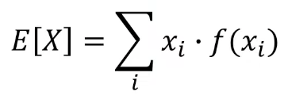
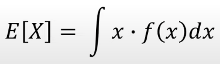

# 수학 개념과 용어 정리..

## Index

- [수학 개념과 용어 정리..](#수학-개념과-용어-정리)
  - [Index](#index)
  - [선형 대수학](#선형-대수학)
  - [통계학](#통계학)
    - [why Statistics?](#why-statistics)
    - [확률분포](#확률분포)
    - [이산확률분포](#이산확률분포)
    - [연속확률분포](#연속확률분포)
    - [기댓값](#기댓값)
    - [몬테카를로 샘플링](#몬테카를로-샘플링)
  - [KL-Divergence](#kl-divergence)
    - [정보 엔트로피 (information entropy)](#정보-엔트로피-information-entropy)
    - [엔트로피: 평균 정보량](#엔트로피-평균-정보량)
    - [크로스 엔트로피](#크로스-엔트로피)
    - [KL Divergence: 정보 엔트로피의 상대적 비교](#kl-divergence-정보-엔트로피의-상대적-비교)
    - [Jenson-Shannone Divergence](#jenson-shannone-divergence)

--- 

## 선형 대수학

## 통계학

### why Statistics?

딥러닝은 확률론 기반의 기계학습 이론에 바탕을 두고 있다.

기계 학습에서 사용되는 손실함수들은 데이터 공간을 통계적으로 해석해서 유도된 것이다. 이런 손실함수를 사용하여 모델들을 학습시키므로, 확률론을 이해해야 딥러닝 모형 학습의 원리를 이해할 수 있다. 

- 회귀 분석에서 $L_2 - norm$은 예측오차의 분산을 최소화하는 방향으로 학습할 수 있도록 유도한다.
- 분류 문제에서 $Cross Entropy$는 모델예측의 불확실성을 최소화하는 방향으로 학습하도록 유도한다. 

### 확률분포

확률 변수가 특정한 값을 가질 확률을 나타내는 함수를 의미한다.


### 이산확률분포

확률변수 X의 개수를 정확히 셀 수 있을 때 이산확률분포라고 말한다.

- $P(X = x)$는 확률변수가 x값을 가질 확률이다.
- 확률질량함수라고 부른다.


### 연속확률분포

확률변수 X의 개수를 정확히 셀 수 없을 때 연속 확률분포라고 말한다.


- 확률 변수 $X$에 대하여 새로운 확률변수 $Z=\frac{X-\mu}{\sigma}$로 정의하면 평균과 분산이 항상 0과 1이다. 따라서 확률변수 $Z$를 확률변수 $X$의 표준화 확률변수라고 한다.


ex) 정규분포

<strong>정규 분포(Gaussian Distribution)</strong>

연속 확률 분포의 하나이다. 정규분포는 수집된 자료의 분포를 근사하는 데에 자주 사용된다. 이것은 중심극한정리에 의하여 독립적인 확률변수들의 평균은 정규분포에 가까워지는 성질이 있기 때문이다.

사람의 얼굴에도 통계적인 평균치가 존재할 수 있다. 모델은 이를 수치적으로 표현할 수 있게 된다. 이때의 확률 분포는 이미지에서의 다양한 특징들이 각각의 확률 변수가 되는 분포를 의미한다.

<strong>다변수 확률 분포</strong>


<strong>가우시안 노이즈</strong>


이런 식으로 사진이 지지직 거리는 느낌의 잡음을 가우시안 노이즈라고 한다. 이름이 가우시안 노이즈인 이유는, 이름처럼 가우스 함수에 따른 분포를 따르고 있기 때문이다.

```python
def make_noise(std, gray):
    height, width = gray.shape
    img_noise = np.zeros((height, width), dtype=np.float)
    for i in range(height):
        for a in range(width):
            make_noise = np.random.normal()  # 랜덤함수를 이용하여 노이즈 적용
            set_noise = std * make_noise
            img_noise[i][a] = gray[i][a] + set_noise
    return img_noise
```

<strong>가능도</strong>

Likelihood라고 하며 확률과는 다른 의미를 가진다. 연속확률분포에서는 이산확률분포와 다르게 하나의 확률변수에 대한 확률이 0이다. 왜냐하면 실수 전체에 대해서 변수가 정의되어 있기 때문이다. 이로 인해서 연속확률분포에서는 그 구간안에 속할 가능성을 말하는 방법으로 확률을 대체한다. 이때 가능도는 간단하게 말하자면 확률밀도함수에서의 y값이라고 보면 된다고 한다.

### 기댓값

확률변수의 기댓값은 확률적 사건에 대한 평균값으로, 사건이 일어나서 얻는 값과 그 사건이 일어날 확률을 곱한 것을 모든 사건에 대해 합한 값이다. 

=> 확률적 사건에 대한 **평균의 의미** + **데이터를 대표하는 통계량** + 다른 통계적 범함수를 계산하는 데에 사용

기댓값은 모든 사건에 대해 확률을 곱하면서 더하여 계산할 수 있다.

-   이산확률변수의 기댓값



-   연속확률변수의 기댓값




### 몬테카를로 샘플링

만약 확률분포를 매우 잘 알고 있어서, 확률밀도함수를 사용할지 확률질량함수를 사용할지 등을 잘 알고 있으면 기계학습에서의 기댓값을 계산하는 데에 이용할 수 있다. 그러나 많은 묺제들은 확률분포를 명시적으로 모를때가 대부분이다. 확률분포를 모를 때 데이터를 이용해서 기댓값을 계산하려면, 몬테카를로 샘플링 방법을 이용할 수 있다.

몬테카를로법은 간단히 말해서 무작위 수와 확률로 시뮬레이션을 설계하여 복잡한 문제의 해를 근사적으로 구하는 방법을 말한다. 횟수가 늘어날수록 추정은 더 정확해져서 데이터가 많이 필요하다.    

## KL-Divergence

[위 블로그를 참고하여 작성했습니다.](https://angeloyeo.github.io/2020/10/26/information_entropy.html)

### 정보 엔트로피 (information entropy)

**정보란 무엇일까?** 

- cs 적으로 본다면 데이터를 사용할 수 있도록 가공한 것으로 볼 수도 있다.
- 통계학적으로 본다면 정보는 바로 **깜짝 놀랄만한 정도**를 말한다.

=> 통계학에서는 확률이 낮은 사건일수록 정보량은 높은 것이다. 왜냐면 일어나면 더 많이 놀라기 때문이다.

$Info \propto \frac{1}{P(X)}$

조금 더 구체적으로 통계학에서 정보량은 이산 랜덤변수 $X$에 대해,


이다.

왜 로그를 사용했을까? 

- 확률값에 반비례 해야 하기 때문이다.
- 두 사건의 정보량을 합치면 각 사건의 정보량을 합친 것과 같아야 한다. 

### 엔트로피: 평균 정보량

통계학에서 엔트로피는 물리학의 엔트로피와는 다르게 평균 정보량을 의미한다. 


$H(X) = E[I(X)]$

$E[-]$는 기댓값 연산자를 의미한다.

### 크로스 엔트로피

크로스 엔트로피는 한마디로 하면 "예측과 달라서 생기는 깜놀도"라고 할 수 있다.

- 두가지 출력 case를 가지면 => Binary Cross Entropy
- 여라가지 출력 case를 가지면 => Cross Entropy 

### KL Divergence: 정보 엔트로피의 상대적 비교

KullBack-Leibler 발산을 줄여서 쓴 말이다. divergence의 의미는 벡터장의 발산과 같은 개념이 아니라, 그저 "차이"를 다른 말로 쓴 것이다.

"차이"란 두 확률 분포를 비교한다는 말이다. 통계적으로 P는 사후, Q는 사전 분포를 의미한다. 

$D_{KL}(P\|Q) = \sum_{x\in \chi}P(x)\log_b\left(\frac{P(x)}{Q(x)}\right)$

KL Divergence는 위와 같다.

KLD는 값이 낮을수록 두 분포가 유사하다고 해석할 수 있다. 

### Jenson-Shannone Divergence

실제 진짜를 모방하기 위해 가짜의 분포를 정말 잘 만들어내야 하는 GAN에서는 이에 대한 정보가 굉장히 중요하다. 

JSD를 활용하여 A와 B 사이의 거리를 구해서 최적화에 사용할 수 있다. 